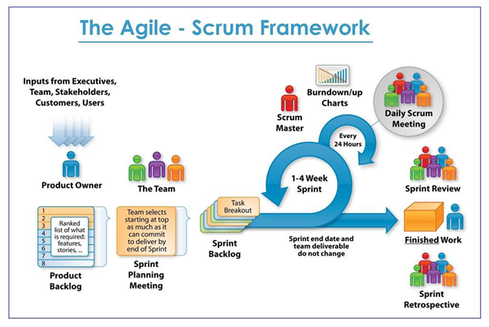
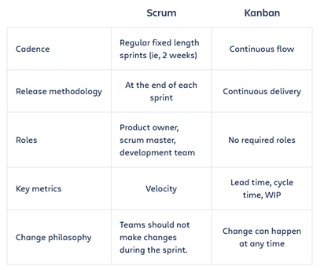

# Agile_Scrum_Kanban
## Agile Principles
• Individuals and interactions over processes and tools
• Working software over comprehensive documentation
• Customer collaboration over contract negotiation
• Responding to change over following a plan
How have we implemented agile?
Throughout our weekly training sprints we are constantly communicating face to face as a team and throughout the process are having daily scrum meetings in the mornings as well as weekly sprint reviews where we review the week and find out what went well and what could have been done better.
## Scrum	
Scrum is a framework used to enable teams to work together easier and focuses on learning through experiences and reflection on wins and losses to constantly improve

There are about three roles within scrum which are listed below:
• Scrum Master – responsible for holding the scrum together and ensuring the scrum is done well. They are also responsible for helping product owner define value and ensuring the development team deliver that value.
• Development team – comprised of designers, writes, programmers and many more people. They are responsible for developing the project and doing the work.
• Product Owner – responsible for ensuring that the agile team  are delivering the most value. They should understand the customer and have a vision for the value which is being delivered to the customer.
Scrum Artefacts:
• Product Backlog
• Sprint Backlog
• Product Increment
Scrum Ceremonies:
•	Sprint Planning – team meeting to decide what to complete (before project start)(1-2 hours)
•	Daily Scrum – short meeting to make sure everyone is on same page (during project)(15 mins)
•	Sprint Review – meeting to demo what was shipped in the sprint (end of sprint)
•	Sprint Retrospective – review of work to identify what went well and what can be improved (after sprint)
The 3 amigos
The 3 amigos refers to the primary perspectives to examine work before, during and after development and refers to the following perspectives:
•	Business – What is the problem to be solved?
•	Development – How might a solution be developed?
•	Testing – what could happen?

## Epic Story
Epic Story - Big chunk of work that can be divided into small user stories and can be split over multiple sprints and can be a high-level description of what the client wants. Scope is changeable over time and helpful to organise work and create a hierarchy. It allows us to break work into shippable pieces to ship value to customers on a regular basis and helps teams break work down while working towards bigger goals
Can be broken down in three main ways:
•	Workflow breakdown
•	Role-based breakdown
•	Break down around the timeline
## User Story
User Story - are simple descriptions of a feature or function which is told from the point of view of the person who desires the new capability. Often these user stories are users or customers of the product.
Detail is added to user stories in two main ways:
•	Splitting the user stories into multiple but smaller user stories
•	Adding more conditions
User Story Benefits:
•	Stories keep the focus on the user. A To Do list keeps the team focused on tasks that need checked off, but a collection of stories keeps the team focused on solving problems for real users. 
•	Stories enable collaboration. With the end goal defined, the team can work together to decide how best to serve the user and meet that goal.
•	Stories drive creative solutions. Stories encourage the team to think critically and creatively about how to best solve for an end goal.
•	Stories create momentum. With each passing story the development team enjoys a small challenges and a small win, driving momentum.
Source: (https://www.atlassian.com/agile/project-management/user-stories)
## How Do Epic and User Stories Fit with Agile and Scrum
Epic Stories (Agile)
•	An agile epic is a body of work that can be broken down into specific tasks (called user stories) based on the needs/requests of customers or end users.
Epic Stories (SCRUM)
•	In the context of a SCRUM, an epic is a user story which is too big to fit in one sprint
User Stories (Agile)
•	In agile, user stories allow for the software development team to put the users story and feedback at the centre of the conversation which will allow the team to know what to change in the development cycle.
User Stories (SCRUM)
•	In SCRUM, user stories are added within sprints are periodically resolves over the sprint.
### Planning Poker
This is a team activity utilised by scrum teams during sprint planning to estimate the size of product backlog items. It is useful as it allows the development team time to learn about upcoming work, learn about the system which will be built and get diverse estimates for time to complete the project.
### INVEST
INVEST is an acronym used to assess the quality of a user story.
I – Independent (of all)
N – Negotiable 
V – Valuable
E – Estimable (a good approximation)
S – Small (able to fit within an iteration)
T – Testable 

## Kanban
Kanban is a framework used to implement agile and is achieved through the use of a Kanban board where team members are able to see the state of every task at any time. It relates to agile as Kanban is used to help teams adhere to agile principles by increasing productivity. The following table summarises how Kanban compares to scrum.

### When to use Kanban?
Kanban is more versatile than scrum and often both are employed together which is referred to as “Scrum-ban”. The versatility of Kanban means you can pick parts that you want to use and leave out parts which you don’t want to use. 
Kanban focuses on flow and throughput allowing the team to visualise and burn through small pieces of work as they come up. This is because the Kanban board will show to all team members in small packages. Planning is also not important in this stage.
As a result, Kanban is utilised for smaller project whereas scrum is employed where more planning is required. However, scrum and Kanban can be deployed together to gain the benefits of both methodologies.

